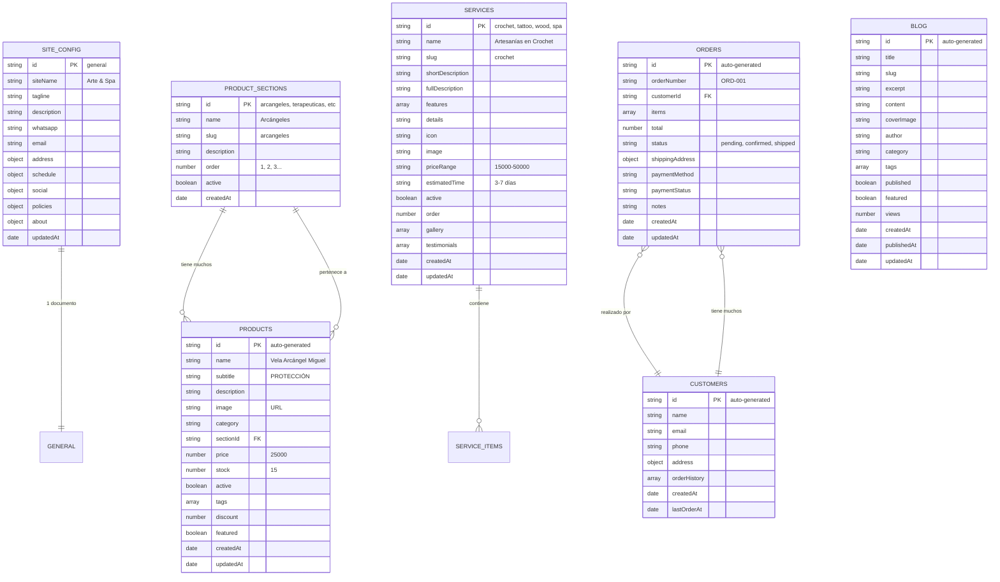

# 🗺️ Mapa Visual del Esquema de Base de Datos

## 📊 Estructura de Colecciones Firebase Firestore

```
📦 Firebase Firestore (data-spa)
│
├── 📁 siteConfig (1 documento)
│   └── 📄 general
│       ├── Información del sitio
│       ├── Datos de contacto
│       ├── Ubicación y horarios
│       ├── Redes sociales
│       ├── Políticas
│       └── Sobre nosotros
│
├── 📁 productSections (6+ documentos)
│   ├── 📄 arcangeles
│   ├── 📄 terapeuticas
│   ├── 📄 chakras
│   ├── 📄 proteccion
│   ├── 📄 abundancia
│   └── 📄 amor
│
├── 📁 products (13+ documentos)
│   ├── 📄 [auto-id-1] → Vela Arcángel Miguel
│   ├── 📄 [auto-id-2] → Vela Arcángel Rafael
│   ├── 📄 [auto-id-3] → Vela Terapéutica Relajación
│   ├── 📄 [auto-id-4] → Vela Chakra Raíz
│   └── 📄 ...
│
├── 📁 services (4 documentos)
│   ├── 📄 crochet → Artesanías en Crochet
│   ├── 📄 tattoo → Estudio de Tatuajes
│   ├── 📄 wood → Taller de Madera
│   └── 📄 spa → Spa y Bienestar
│
├── 📁 orders (futuro)
│   └── 📄 [auto-id] → Pedidos de clientes
│
├── 📁 customers (futuro)
│   └── 📄 [user-id] → Información de clientes
│
└── 📁 blog (futuro)
    └── 📄 [auto-id] → Artículos del blog
```

## 🔗 Relaciones Entre Colecciones

```
┌─────────────────┐
│  SITE_CONFIG    │ (Configuración General)
└─────────────────┘
        │
        │ No tiene relaciones
        ▼


┌──────────────────┐         1:N          ┌─────────────┐
│ PRODUCT_SECTIONS │◄────────────────────►│  PRODUCTS   │
└──────────────────┘                      └─────────────┘
   (Categorías)                            (Velas y productos)
        │
        │ field: sectionId
        │


┌─────────────────┐
│    SERVICES     │ (Sin relaciones directas)
└─────────────────┘
  (Crochet, Tattoo, Wood, Spa)


┌─────────────────┐         1:N          ┌─────────────┐
│   CUSTOMERS     │◄────────────────────►│   ORDERS    │
└─────────────────┘                      └─────────────┘
   (Clientes)                             (Pedidos)
        │
        │ field: customerId
        │
        └───► orderHistory: string[]
```

## 📈 Flujo de Datos en la Aplicación

```
┌─────────────────────────────────────────────────────────────┐
│                      NAVEGADOR DEL USUARIO                  │
└─────────────────────────────────────────────────────────────┘
                              │
                              │ HTTP Request
                              ▼
┌─────────────────────────────────────────────────────────────┐
│                     NEXT.JS FRONTEND                        │
│  ┌──────────────────────────────────────────────────────┐   │
│  │  app/page.tsx (Landing Page)                         │   │
│  │  - Hero Section                                      │   │
│  │  - Servicios                                         │   │
│  │  - Productos (Tienda Natural)                       │   │
│  │  - Contacto                                          │   │
│  └──────────────────────────────────────────────────────┘   │
│                              │                               │
│                              │ imports                       │
│                              ▼                               │
│  ┌──────────────────────────────────────────────────────┐   │
│  │  lib/products.ts                                     │   │
│  │  - getProducts()                                     │   │
│  │  - getProductsBySection()                            │   │
│  │  - getSections()                                     │   │
│  │  - addProduct() [Admin]                              │   │
│  │  - updateProduct() [Admin]                           │   │
│  │  - deleteProduct() [Admin]                           │   │
│  └──────────────────────────────────────────────────────┘   │
│                              │                               │
│                              │ Firebase SDK                  │
│                              ▼                               │
│  ┌──────────────────────────────────────────────────────┐   │
│  │  lib/firebase.ts                                     │   │
│  │  - db (Firestore instance)                           │   │
│  │  - storage (Storage instance)                        │   │
│  │  - auth (Auth instance)                              │   │
│  └──────────────────────────────────────────────────────┘   │
└─────────────────────────────────────────────────────────────┘
                              │
                              │ Firebase API
                              ▼
┌─────────────────────────────────────────────────────────────┐
│                    FIREBASE CLOUD                           │
│  ┌──────────────────────────────────────────────────────┐   │
│  │  Cloud Firestore (Database)                          │   │
│  │  - siteConfig/                                       │   │
│  │  - productSections/                                  │   │
│  │  - products/                                         │   │
│  │  - services/                                         │   │
│  │  - orders/ (futuro)                                  │   │
│  │  - customers/ (futuro)                               │   │
│  └──────────────────────────────────────────────────────┘   │
│                                                              │
│  ┌──────────────────────────────────────────────────────┐   │
│  │  Cloud Storage (Imágenes)                            │   │
│  │  - products/                                         │   │
│  │  - services/                                         │   │
│  │  - blog/                                             │   │
│  └──────────────────────────────────────────────────────┘   │
│                                                              │
│  ┌──────────────────────────────────────────────────────┐   │
│  │  Authentication (Usuarios)                           │   │
│  │  - Admin users                                       │   │
│  │  - Customers                                         │   │
│  └──────────────────────────────────────────────────────┘   │
└─────────────────────────────────────────────────────────────┘
```

## 🔄 Operaciones CRUD

### Productos (Products)

```
┌─────────────┐     READ      ┌─────────────────┐
│  Frontend   │◄──────────────│  getProducts()  │
│  (Público)  │               └─────────────────┘
└─────────────┘                        │
                                       │
                                       ▼
                              ┌─────────────────┐
                              │    Firestore    │
                              │   products/     │
                              └─────────────────┘
                                       ▲
                                       │
┌─────────────┐  CREATE/UPDATE/DELETE  │
│  Admin      │───────────────────────►│
│  Panel      │                        │
└─────────────┘                        │
     │                                 │
     ├─ addProduct()                   │
     ├─ updateProduct()                │
     └─ deleteProduct()                │
```

### Configuración del Sitio

```
┌─────────────┐     READ      ┌──────────────────┐
│  Frontend   │◄──────────────│  siteConfig/     │
│             │               │  general         │
└─────────────┘               └──────────────────┘
                                       ▲
                                       │
┌─────────────┐     UPDATE             │
│  Admin      │───────────────────────►│
│  Panel      │                        │
└─────────────┘                        │
```

## 🎯 Índices Recomendados

Para optimizar las consultas, crea estos índices compuestos:

```
products
  ├─ sectionId (ASC) + active (ASC)
  ├─ category (ASC) + active (ASC)
  ├─ featured (ASC) + active (ASC) + createdAt (DESC)
  └─ active (ASC) + createdAt (DESC)

services
  └─ active (ASC) + order (ASC)

orders
  ├─ customerId (ASC) + createdAt (DESC)
  ├─ status (ASC) + createdAt (DESC)
  └─ paymentStatus (ASC) + createdAt (DESC)

blog
  └─ published (ASC) + featured (ASC) + publishedAt (DESC)
```

## 📦 Tamaño Estimado de Datos

| Colección | Documentos | Tamaño Aprox. | Lecturas/mes |
|-----------|------------|---------------|--------------|
| siteConfig | 1 | ~5 KB | ~10,000 |
| productSections | 6 | ~2 KB | ~5,000 |
| products | 50-100 | ~50 KB | ~50,000 |
| services | 4 | ~8 KB | ~20,000 |
| orders | Variable | Variable | Variable |
| customers | Variable | Variable | Variable |

**Total estimado**: ~65 KB para datos iniciales

## 🔐 Niveles de Acceso

```
┌─────────────────────────────────────────────────────┐
│                  NIVEL DE ACCESO                    │
├─────────────────────────────────────────────────────┤
│  Público (No autenticado)                           │
│  ✓ Leer: siteConfig, productSections, products,    │
│    services, blog (publicados)                      │
│  ✗ Escribir: Nada                                   │
├─────────────────────────────────────────────────────┤
│  Usuario Autenticado                                │
│  ✓ Leer: Todo lo público + sus propios orders       │
│  ✓ Escribir: Crear orders, actualizar su perfil    │
├─────────────────────────────────────────────────────┤
│  Administrador                                       │
│  ✓ Leer: TODO                                       │
│  ✓ Escribir: TODO                                   │
└─────────────────────────────────────────────────────┘
```

---

**Última actualización**: Octubre 2025
